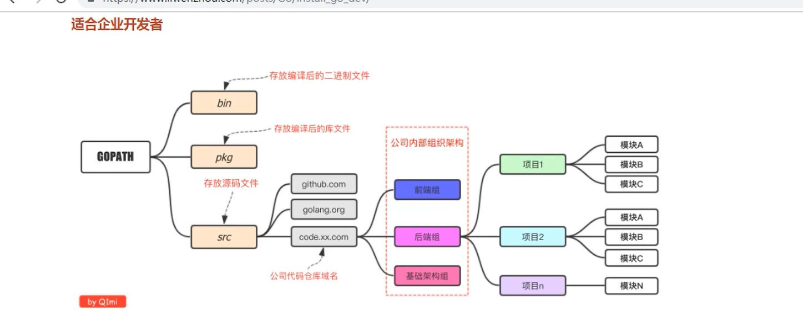

# Go笔记

[李文周博客](https://www.liwenzhou.com/posts/Go/golang-menu/)

## 一、环境搭建

### 1.1目录架构



### 1.2 运行编译

####    go加速

````bash
go env -w GOPROXY=https://goproxy.cn,direct
go env
````

####    go编译

````bash
go build hello.go
#生成exe可执行文件

go build -o hello-rename.exe hello.go
#重命名exe文件
````

####     go直接执行

````bash
go run hello.go
````

#### go跨平台编译(交叉编译)

````bash
SET CGO_ENABLED=0
SET GOOS=linux
SET GOARCH=amd64
go build
````


#### 1.3 Hello World!

````GO
package main

// 导入语句
import "fmt"

// 函数外只能防止标识符（变量\常量\函数\类型）的声明
// fmt.Println("Hello") // 非法

// 程序的入口函数
func main() {
	fmt.Println("Hello world!")
}
````

**main函数是程序的入口，package如果是main，go build出来的是个二进制文件，而且必须存在main函数，为程序入口的函数。**

## 变量和常量

### 变量声明，变量赋值

变量声明格式

步骤： 申明->赋值->使用

`var 变量名 变量类型`

````go
package main

import "fmt"

/* 声明变量
var name string
var num int
var isOk bool
*/

//推荐使用小驼峰声明变量
var studentName string

// 批量声明，全局变量
var (
	name string
	num  int
	isOk bool
)

// s4 := "asd"

func main() {
	name = "理想迈巴赫"
	num = 114514
	isOk = true
	//Go语言中非全局变量声明后必须使用，不使用就编译不过去
	fmt.Print(isOk) // 在终端中输出要打印的内容
	fmt.Println()
	fmt.Printf("我的：%s\n", name) //%s:占位符 使用name这个变量的值去替换占位符
	fmt.Println(num)            // 打印完指定的内容之后会在后面加一个换行符

	// 声明变量同时赋值
	var s1 string = "hello-s1"
	fmt.Println(s1)

	// 类型推导（根据值判断该变量是什么类型）
	var s2 = "hello-s2"
	fmt.Println(s2)

	// 简短变量声明，只能在函数里面用,不能在全局变量使用，常用
	s3 := "hello-s3"
	fmt.Println(s3)

	// s1 := "10" // 同一个作用域（{}）中不能重复声明同名的变量
	// 匿名变量是一个特殊的变量：_(后面学了函数再说)
}


//输出结果
true
我的：理想迈巴赫
114514
hello-s1
hello-s2
hello-s3

````


### 常量

相对于变量，常量是恒定不变的值，多用于定义程序运行期间不会改变的那些值。 常量的声明和变量声明非常类似，只是把`var`换成了`const`，常量在定义的时候必须赋值。

**iota** 是go语言的常量计数器，只能在常量的表达式中使用。

`iota`在const关键字出现时将被重置为0。const中**每新增一行常量声明将使`iota`计数一次**(iota可理解为const语句块中的行索引)。 使用iota能简化定义，在定义枚举时很有用。

````go
package main

import "fmt"

// 常量
// 定义了常量之后不能修改
// 在程序运行期间不会改变的量
const pi = 3.1415

// 批量声明常量
const (
	codeOk   = 200
	notFound = 404
)

// 批量声明常量时，如果某一行声明后没有赋值，默认就和上一行一致
const (
	n1 = 100
	n2
	n3
)

//iota
const (
	a1 = iota //0
	a2        //1
	a3        //2
)

const (
	b1 = iota //0
	_         //1   匿名变量丢弃
	b2        //2
	b3        //3
)

//插队
const (
	c1 = iota //0
	c2 = 100  //100
	c3 = iota //2
	c4        //3
)

// 多个常量声明在一行
const (
	d1, d2 = iota + 1, iota + 2 // d1=1 d2=2
	d3, d4 = iota + 1, iota + 2 // d3=2 d4=3
)

// 定义数量级
//定义数量级 （这里的<<表示左移操作，1<<10表示将1的二进制表示向左移10位，
//也就是由1变成了10000000000，也就是十进制的1024。同理2<<2表示将2的二进制表示向左移2位，
//也就是由10变成了1000，也就是十进制的8。）
const (
	_  = iota
	KB = 1 << (10 * iota) //2^10 1024
	MB = 1 << (10 * iota) //2^20 1048576
	GB = 1 << (10 * iota)
	TB = 1 << (10 * iota)
	PB = 1 << (10 * iota)
)

func main() {
	//	fmt.Println("pi:", pi)            //pi: 3.1415
	//	fmt.Println("codeOk:", codeOk)    //codeOk: 200
	//	fmt.Println("notFound", notFound) //notFound 404
	//	fmt.Println("n1:", n1)            //n1: 100
	//	fmt.Println("n2:", n2)            //n2: 100
	//	fmt.Println("n3:", n3)            //n3: 100
	//fmt.Println("a1:", a1)
	//fmt.Println("a2:", a2)
	//fmt.Println("a3:", a3)
	//fmt.Println("b1:", b1)
	//fmt.Println("b2:", b2)
	//fmt.Println("b3:", b3)
	//fmt.Println("c1:", c1)
	//fmt.Println("c2:", c2)
	//fmt.Println("c3:", c3)
	//fmt.Println("c4:", c4)
	//fmt.Println("d1:", d1)
	//fmt.Println("d2:", d2)
	//fmt.Println("d3:", d3)
	//fmt.Println("d4:", d4)
	fmt.Println("1KB=", KB, "B")
	fmt.Println("1MB=", MB, "B")
}
````

### 整型

````go
package main

import "fmt"

func main() {
	var i1 = 114514
	fmt.Printf("%d\n", i1) //十进制
	fmt.Printf("%b\n", i1) //二进制
	fmt.Printf("%o\n", i1) //八进制
	fmt.Printf("%x\n", i1) //十六进制

	i2 := 077 //赋值八进制
	fmt.Printf("i2转化10进制: %d\n", i2)

	i3 := 0x12345 //赋值十六进制
	fmt.Printf("i3转化10进制: %d\n", i3)
	// 声明int8类型的变量
	i4 := int8(11)       //明确指定int8类型，否则就是默认为int类型
	fmt.Printf("%T", i4) //int8
}
````

### 浮点型

````go
package main

import (
	"fmt"
)

// 浮点数
func main() {
	//math.MaxFloat64 // float32最大值
	f1 := 3.1415926
	fmt.Printf("%T\n", f1) // 默认Go语言中的小数都是float64类型

	f2 := float32(3.1415926) // 显示声明float32类型
	fmt.Printf("%T", f2)
	// f1 = f2   // float32类型的值不能直接复赋值给float64类型的变量
	//f1 = float64(f2)
}
````

### 布尔型

````go
package main

import "fmt"

func main() {
	b1 := true
	fmt.Printf("%T\n", b1)
	var v2 bool // 默认是false
	fmt.Printf("%T, v2value=%v", v2, v2)
}
````

### fmt格式占位符,类型

````go
package main

import "fmt"

func main() {
	var n = 100
	fmt.Printf("%T\n", n)  //打印值的类型
	fmt.Printf("%d\n", n)  //十进制
	fmt.Printf("%b\n", n)  //二进制
	fmt.Printf("%o\n", n)  //八进制
	fmt.Printf("%x\n", n)  //十六进制
	fmt.Printf("%v\n", n)  //值的默认格式表示
	var s = "hello！我是艾卡大王"
	fmt.Printf("字符串:%s\n", s)  //字符串打印
	fmt.Printf("字符串:%v\n", s)  //字符串:hello！我是艾卡大王  
	fmt.Printf("字符串:%#v", s)   //字符串:"hello！我是艾卡大王"   //会加引号

}
````

### 字符串

#### 字符串常用方法

|                方法                 |      介绍      |
| :---------------------------------: | :------------: |
|              len(str)               |     求长度     |
|           +或fmt.Sprintf            |   拼接字符串   |
|            strings.Split            |      分割      |
|          strings.contains           |  判断是否包含  |
| strings.HasPrefix,strings.HasSuffix | 前缀/后缀判断  |
| strings.Index(),strings.LastIndex() | 子串出现的位置 |
| strings.Join(a[]string, sep string) |    join操作    |

````go
package main

import (
	"fmt"
	"strings"
)

func main() {
	path := "'C:\\Users\\HASEE\\Desktop\\learning-materials'"
	fmt.Println(path) //'C:\Users\HASEE\Desktop\learning-materials'
	s := "I'm ok"
	fmt.Println(s) //I'm ok

	//多行字符串
	s1 := `
	多行测试
	行一
	举头望明月
低头思故乡
								此致
							敬礼
	`
	fmt.Println(s1)

	s2 := `C:\Users\HASEE\Desktop\learning\go\class1-lnh\src\qjh.test.com\studygo\day1\04int`
	fmt.Println(s2)      //C:\Users\HASEE\Desktop\learning\go\class1-lnh\src\qjh.test.com\studygo\day1\04int
	fmt.Println(len(s2)) //字符串长度

	//字符串拼接
	dream := "理想"
	mayBach := "迈巴赫"
	ss := dream + mayBach
	//fmt.Printf("%s%s", dream, mayBach)
	fmt.Println(ss) //理想迈巴赫

	ret := strings.Split(s2, "\\")
	fmt.Println(ret) //[C: Users HASEE Desktop learning go class1-lnh src qjh.test.com studygo day1 04int]
	// 包含
	fmt.Println(strings.Contains(ss, "迈巴赫")) //true
	fmt.Println(strings.Contains(ss, "奇瑞"))  //false
	// 前缀
	fmt.Println(strings.HasPrefix(ss, "理想")) //true  //判断包含
	// 后缀
	fmt.Println(strings.HasSuffix(ss, "赫")) //true

	//获取index位置
	s3 := "akjashd"
	fmt.Println(strings.Index(s3, "a"))     //0
	fmt.Println(strings.LastIndex(s3, "a")) //3
	fmt.Println(strings.Index(s3, "av"))    //-1

	//拼接
	fmt.Println(strings.Join(ret, "+")) //C:+Users+HASEE+Desktop+learning+go+class1-lnh+src+qjh.test.com+studygo+day1+04int

}
````

### rune型与byte型

````go
package main

import "fmt"

func main() {
	s := "Hello沙河사샤"
	//n := len(s)
	//for i := 0; i < n; i++ {
	//	fmt.Println(s[i])
	//	fmt.Printf("%c\n", s[i])
	//}
	for _, c := range s { // 从字符串中拿出具体的字符
		fmt.Printf("%c\n", c) // %c:字符
	}
	// "Hello" => 'H' 'e' 'l' 'l' 'o'

	//实现字符串替换
	s2 := "白萝卜"      //字符串不能修改   // => '白' '萝' '卜'
	s3 := []rune(s2) // 把字符串强制转换成了一个rune切片
	//fmt.Printf("%v,%c", s3[0], s3[0])
	s3[0] = '红'
	fmt.Println(string(s3)) // 把rune切片强制转换成字符串

	c1 := "红" //string
	c2 := '红' //int32
	fmt.Printf("c1:%T,c2:%T\n", c1, c2)

	c3 := "H"       //string
	c4 := byte('H') //uint8
	fmt.Printf("c3:%T,c4:%T\n", c3, c4)
	fmt.Printf("%d\n", c4) //72

	//类型转换
	n1 := 10 //int
	var f float64 = float64(n1)
	fmt.Println(f)        //10
	fmt.Printf("%T\n", f) //float64
}
````

### if

````go
package main

import "fmt"

func main() {
	// age := 19

	// if条件判断
	/*	if age >= 18 {
			fmt.Println("澳门皇冠线上赌场开业啦！")
		} else {
			fmt.Println("快写暑假作业吧！")
		}
	*/

	// 多个判断条件
	/*	if age >= 35 {
			fmt.Println("赶紧去上班吧")
		} else if age >= 18 {
			fmt.Println("赶紧毕业吧！")
		} else {
			fmt.Println("快写暑假作业！")
		}
	*/

	// 作用域
	// age变量此时只在if条件判断语句中生效
	if age := 19; age > 18 {
		fmt.Println("你已经成年啦！")
	} else {
		fmt.Println("快写暑假作业吧！")
	}
	age := 114514
	fmt.Println(age) //114514

}
````

### for循环

````go
package main

import (
	"fmt"
)

// for循环
func main() {
	// 基本格式
	for i := 0; i < 10; i++ {
		fmt.Println(i)
	}

	// 变种1
	/* var i = 5
	for ; i < 10; i++ {
		fmt.Println(i)
	}
	fmt.Println(i) //10
	*/

	// 变种2
	var i = 5
	for i < 10 {
		fmt.Println(i)
		i++
	}

	// 无限循环
	// for {
	// 	fmt.Println("123")
	// }

	// for range循环
	s := "Hello老钱"
	for i, v := range s {
		fmt.Printf("%d,%c\n", i, v)
	}

}
````

### 九九乘法表

````go
package main

import "fmt"

func main() {
	for i := 1; i < 10; i++ {
		for j := 1; j <= i; j++ {
			fmt.Printf("%d*%d=%d\t", j, i, i*j)
		}
		fmt.Println()

	}
}
````


## 函数

### 常规

````go
package main

import "fmt"

// 函数:一段代码的封装

func f1() {
	fmt.Println("Hello 沙河！")
}

func f2(name string) {
	fmt.Println("Hello", name)
}

// 带参数和返回值的函数
func f3(x int, y int) int {
	sum := x + y
	return sum
}

// 参数类型简写
func f4(x, y int) int {
	return x + y
}

// 可变参数
func f5(title string, y ...int) int {
	fmt.Println(y) // y是一个int类型的切片
	return 1
}

// 命名返回值
func f6(x, y int) (sum int) {
	sum = x + y // 如果使用命名的返回值，那么在函数中可以直接使用返回值变量
	return      // 如果使用命名的返回值,return后面可以省略返回值变量
}

// Go语言中支持多个返回值
func f7(x, y int) (sum int, sub int) {
	sum = x + y
	sub = x - y
	return
}


func main() {
	f1()
	f2("理想")
	f2("姬无命")
	fmt.Println(f3(100, 200)) // 调用函数

	ret := f3(100, 200)
	fmt.Println(ret)

	f5("lixiang", 1, 2, 3, 4, 5, 6, 7, 8, 9, 10)
	// 在一个命名的函数中不能够再声明命名函数
	// func f8(){

	// }


}
````

#### day 3 homework

````go
package main

import "fmt"

/*
你有50枚金币，需要分配给以下几个人：Matthew,Sarah,Augustus,Heidi,Emilie,Peter,Giana,Adriano,Aaron,Elizabeth。
分配规则如下：
a. 名字中每包含1个'e'或'E'分1枚金币
b. 名字中每包含1个'i'或'I'分2枚金币
c. 名字中每包含1个'o'或'O'分3枚金币
d: 名字中每包含1个'u'或'U'分4枚金币

写一个程序，计算每个用户分到多少金币，以及最后剩余多少金币？
程序结构如下，请实现 ‘dispatchCoin’ 函数
*/
var (
	coins = 50
	users = []string{
		"Matthew", "Sarah", "Augustus", "Heidi", "Emilie", "Peter", "Giana", "Adriano", "Aaron", "Elizabeth",
	}
	distribution = make(map[string]int, len(users))
)

func dispatchCoin() (left int) {
	// 1. 依次拿到每个人的名字
	for _, name := range users {
		//distribution[name] = 0
		for _, c := range name {
			switch c {
			case 'e', 'E':
				distribution[name]++
				coins--
			case 'i', 'I':
				distribution[name] += 2
				coins -= 2
			case 'o', 'O':
				distribution[name] += 3
				coins -= 3
			case 'u', 'U':
				distribution[name] += 4
				coins -= 4
			}
		}

	}
	left = coins
	return

	// 2. 拿到一个人名根据分金币的规则去分金币,
	// 2.1 每个人分的金币数应该保存到 distribution 中
	// 2.2 还要记录下剩余的金币数
	// 3. 整个第2步执行完就能得到最终每个人分的金币数和剩余金币数
	//return
}
func main() {
	//left := dispatchCoin()
	//fmt.Println("剩下：", left)
	left := dispatchCoin()
	for k, v := range distribution {
		fmt.Printf("%s,%d\n", k, v)
	}
	fmt.Println("剩下", left)
}
````


### 内置函数

|    内置函数    |                             介绍                             |
| :------------: | :----------------------------------------------------------: |
|     close      |                     主要用来关闭channel                      |
|      len       |      用来求长度，比如string、array、slice、map、channel      |
|      new       | 用来分配内存，主要用来分配值类型，比如int、struct。返回的是指针 |
|      make      |   用来分配内存，主要用来分配引用类型，比如chan、map、slice   |
|     append     |                 用来追加元素到数组、slice中                  |
| panic和recover |                        用来做错误处理                        |

### 作用域

#### 局部/全局 变量作用域

````go
package main

import "fmt"

// 变量的作用域
var x = 100 // 定义一个全局变量

// 定义一个函数
func f1() {
	//x = 114514
	name := "qjh"
	// 函数中查找变量的顺序
	// 1. 先在函数内部查找
	// 2. 找不到就往函数的外面查找,一直找到全局
	fmt.Println(x, name)
}
func main() {
	f1()
    // fmt.Println(name) // 函数内部定义的变脸只能在该函数内部使用
}

````

#### 语句块作用域

````go
package main

import "fmt"


func main() {
	// 语句块作用域
	if i := 10; i < 18 {
		fmt.Println("乖乖上学")
	}
	// fmt.Println(i) // 不存在i
	for j := 0; j < 5; j++ {
		fmt.Println(j)
	}
	// fmt.Println(j) // 不存在j
}
````

### 函数类型

````go
package main

import "fmt"

func f1() {
	fmt.Println("Hello 沙河！")
}

func f2() int {
	return 10
}

func f4(x, y int) int {
	return x + y
}

// 函数也可以作为参数的类型
func f3(x func() int) {
	ret := x()
	fmt.Println(ret)
}
func ff(a, b int) int {
	return a + b
}

// 函数还可以作为返回值
func f5(x func() int) func(int, int) int {
	return ff
}
func main() {
	a := f1
	fmt.Printf("%T\n", a) //func()
	b := f2
	fmt.Printf("%T\n", b)  //func() int
	f3(f2)                 //10
	f3(b)                  //10
	fmt.Printf("%T\n", f5) //func(func() int) func(int, int) int
	f7 := f5(f2)
	// f3(f4)
	fmt.Printf("%T", f7) //func(int, int) int

}
````


### 匿名函数

````go
package main

import "fmt"

// 匿名函数
/*var f1 = func(x, y int) {
	fmt.Println(x + y)

}*/

func main() {
	// 函数内部没有办法声明带名字的函数
	// 匿名函数
	f1 := func(x, y int) {
		fmt.Println(x + y)
	}
	f1(100, 200) //300

	// 如果只是调用一次的函数，还可以简写成立即执行函数
	func(x, y int) {
		fmt.Println(x + y)
		fmt.Println("Hello world!")
	}(100, 200)
	//3000
	//Hello world!
}

````

### 高阶函数

函数也是一种类型，它可以作为参数，也可以作为返回值。

```go
// 函数也可以作为参数的类型
func f3(x func() int) {
	ret := x()
	fmt.Println(ret)
}

func ff(a, b int) int {
	return a + b
}

// 函数还可以作为返回值
func f5(x func() int) func(int, int) int {
	return ff
}
```

### 闭包

````go
package main

import "fmt"

func f1(f func()) {
	fmt.Println("this is f1")
	f()
}

func f2(x, y int) {
	fmt.Println("this is f2")
	fmt.Println(x + y)
}

// 要求：
// f1(f2)
func f3(f func(int, int), x, y int) func() {
	tmp := func() {
		f(x, y)
	}
	return tmp
}

func main() {
	ret := f3(f2, 100, 200) // 把原来需要传递两个int类型的参数包装成一个不需要传参的函数
	fmt.Printf("%T\n", ret)
	// ret()
	f1(ret)
}

//func()
//this is f1
//this is f2
//300
````

````go
package main

import "fmt"

// 闭包是什么？
// 闭包是一个函数，这个函数包含了他外部作用域的一个变量

// 底层的原理：
// 1. 函数可以作为返回值
// 2. 函数内部查找变量的顺序，先在自己内部找，找不到往外层找

func adder1() func(int) int {
	x := 100
	return func(y int) int {
		x += y
		return x
	}
}
func adder(x int) func(int) int {
	return func(y int) int {
		x += y
		return x

	}
}

func main() {
	ret := adder(100)
	fmt.Println(ret(200)) //300
	fmt.Println(ret(300)) //600
	ret2 := ret(100)
	fmt.Println(ret2) //700

	f1 := adder(10)
	fmt.Println(f1(20)) //30
}
````

````go
package main

import "fmt"

func calc(base int) (func(int) int, func(int) int) {
	a := func(i int) int {
		base += i
		return base
	}
	b := func(i int) int {
		base -= i
		return base
	}
	return a, b
}
func main() {
	f1, f2 := calc(10)
	fmt.Println(f1(1), f2(2)) //11 9
	fmt.Println(f1(3), f2(4)) //12 8
	fmt.Println(f1(5), f2(6)) //13 7

}
````

#### 添加后缀示例

````go
package main

import (
	"fmt"
	"strings"
)

/*
	func main() {
		var string = "操你妈"
		if strings.HasSuffix(string, "逼") {
			fmt.Println("有逼")
		} else {
			fmt.Println("没逼")
		}
	}
*/
// 闭包
func makeSuffixFunc(suffix string) func(string) string {
	return func(name string) string {
		if !strings.HasSuffix(name, suffix) {
			return name + suffix
		} else {
			return name
		}
	}
}
func main() {
	jpgFunc := makeSuffixFunc(".jpg")
	txtFunc := makeSuffixFunc(".txt")
	fmt.Println(jpgFunc("你好"))
	fmt.Println(jpgFunc("不好"))
	fmt.Println(jpgFunc("正常的.jpg"))
	fmt.Println(txtFunc("Maybach"))
	fmt.Println(txtFunc("Benz"))
}

/*
你好.jpg
不好.jpg
正常的.jpg
Maybach.txt
Benz.txt
*/
````

### defer

**💡 快速判断技巧**

遇到这类题时，问自己：

1. **返回值是否命名**？
   - 是 → defer 可直接修改返回值
   - 否 → 看 defer 是否通过闭包捕获了返回值（匿名返回值无法被直接捕获）
2. **defer 是否有参数**？
   - 有参数 → 操作的是副本，不影响外部
   - 无参数 → 闭包可能"偷家"改原件

**🚀 终极口诀**

> "**return 先赋值，defer 后捣乱，
> 闭包逮到就能改，传参只能玩副本**​"

#### defer 基础顺序流程

defer延迟调用，会把defer后面的语句延迟调用

把当时的状态都保存

defer多用于释放资源

多个defer存在时，按照先进后出的方式去执行。

````go
package main

import "fmt"

func deferDemo() {
	fmt.Println("start")
	defer fmt.Println("嘿嘿嘿")
	defer fmt.Println("好好好")
	defer fmt.Println("哟西")
	defer fmt.Println("end")
}
func main() {
	deferDemo()
}

start
end
哟西
好好好
嘿嘿嘿
````


#### defer结合匿名函数

````go
package main

import "fmt"

// Go语言中函数的return不是原子操作，在底层是分为两步来执行
// 第一步：返回值赋值
// defer
// 第二步：真正的RET返回
// 函数中如果存在defer，那么defer执行的时机是在第一步和第二步之间
func f1() int {
	x := 5
	defer func() {
		x++ // 修改的是x不是返回值
	}()
	return x // 1. 返回值赋值 2. defer 3. 真正的RET指令
}

func f2() (x int) {
	defer func() {
		x++
	}()
	return 5 // 返回值=x

}

func f3() (y int) {
	x := 5
	defer func() {
		x++ // 修改的是x
	}()
	return x // 1. 返回值 = y = x = 5 2. defer修改的是x 3. 真正的返回
}

func f4() (x int) {
	defer func(x int) {
		x++ // 改变的是函数中x的副本
	}(x)
	return 5 // 返回值 = x = 5
}

func f5() (result int) {
	x := 5
	defer func() {
		x++
	}()
	result = x
	return // 返回result
}

func main() {
	fmt.Println(f1()) //5
	fmt.Println(f2()) //6
	fmt.Println(f3()) //5
	fmt.Println(f4()) //5
	fmt.Println(f5()) //5

}
````

#### defer会立即执行参数求值

````go
package main

import "fmt"

// defer

func calc(index string, a, b int) int {
	ret := a + b
	fmt.Println(index, a, b, ret)
	return ret
}

func main() {
	a := 1
	b := 2
	defer calc("1", a, calc("10", a, b)) //参数立即求值​
	a = 0
	defer calc("2", a, calc("20", a, b))
	b = 1
}

// 1. a:=1
// 2. b:=2
// 3. defer calc("1", 1, calc("10", 1, 2))
// 4. calc("10", 1, 2) // "10" 1 2 3
// 5. defer calc("1", 1, 3)
// 6. a = 0
// 7. defer calc("2", 0, calc("20", 0, 2))
// 8. calc("20", 0, 2) // "20" 0 2 2
// 9. defer calc("2", 0, 2)
// 10. b = 1
// calc("2", 0, 2) // "2" 0 2 2
// calc("1", 1, 3) // "1" 1 3 4

// 最终的答案：
// "10" 1 2 3
// "20" 0 2 2
//  "2" 0 2 2
// "1" 0 3 3
````

### panic和recover

用于Go的抛出错误与异常处理

使用`panic/recover`模式来处理错误。 `panic`可以在任何地方引发，但`recover`只有在`defer`调用的函数中有效。 首先来看一个例子：

1. `recover()`必须搭配`defer`使用。
2. `defer`一定要在可能引发`panic`的语句之前定义。

````go
package main

import "fmt"

func A() {
	fmt.Println("Plan A")
}
func B() {
	panic("出现致命错误！")
}
func C() {
	fmt.Println("Plan C")
}
func main() {
	A()
	B()
	C()
}

/*
Plan A
panic: 出现致命错误！

goroutine 1 [running]:
main.B(...)
        C:/Users/qjh/Desktop/运维/go/mylearning/mylearning/go/class1-lnh/src/qjh.test.com/studygo/day3/14panic_recover/main.go:9
main.main()
        C:/Users/qjh/Desktop/运维/go/mylearning/mylearning/go/class1-lnh/src/qjh.test.com/studygo/day3/14panic_recover/main.go:16 +0x5b
exit status 2
*/
````

使用recovery挽救

````go
package main

import (
	"fmt"
)

func A() {
	fmt.Println("Plan A")
}
func B() {
	defer func() {
		err := recover()
		fmt.Println(err)
		if err != nil {
			fmt.Println("已恢复PlanB")
		}
	}()
	panic("出现致命错误！")
}
func C() {
	fmt.Println("Plan C")
}
func main() {
	A()
	B()
	C()
}
/*
Plan A
出现致命错误！
已恢复PlanB
Plan C
*/
````

### 递归函数

````go
package main

import "fmt"

// 递归:函数自己调用自己!
// 递归适合处理那种问题相同\问题的规模越来越小的场景
// 递归一定要有一个明确的退出条件

// 3! = 3*2*1     = 3*2!
// 4! = 4*3*2*1   = 4*3!
// 5! = 5*4*3*2*1 = 5*4!

// 计算n的阶乘
func f1(n uint64) uint64 {
	if n <= 1 {
		return 1
	}
	return n * f1(n-1)
}

// 上台阶的面试题
// n个台阶，一次可以走1步，也可以走2步，有多少种走法。
func taijie(n uint64) uint64 {
	if n == 1 {
		return 1
		// 如果只有一个台阶就一种走法
	}
	if n == 2 {
		return 2
	}
	return taijie(n-1) + taijie(n-2)
}

func main() {
	//ret := f1(7)
	//fmt.Println(ret)
	rettj := taijie(3)
	fmt.Println(rettj)
}
````


# 结构体

## 类型别名和自定义类型

在Go语言中有一些基本的数据类型，如`string`、`整型`、`浮点型`、`布尔`等数据类型， Go语言中可以使用`type`关键字来定义自定义类型。

自定义类型是定义了一个全新的类型。我们可以基于内置的基本类型定义，也可以通过struct定义。

````go
package main

import "fmt"

// 自定义类型和类型别名

// type后面跟的是类型

type myInt int64   // 自定义类型
type yourInt = int // 类型别名

func main() {
	var a myInt = 200
	fmt.Printf("%T\n", a) //main.myInt
	b := yourInt(100)
	fmt.Printf("%T\n", b) //int

	var c rune
	c = '好'
	fmt.Printf("%T\n", c) //int32

}
````

通过`type`关键字的定义，`myInt`就是一种新的类型，它具有`int`的特性。

类型别名

类型别名规定：TypeAlias只是Type的别名，本质上TypeAlias与Type是同一个类型。就像一个孩子小时候有小名、乳名，上学后用学名，英语老师又会给他起英文名，但这些名字都指的是他本人

**自定义类型 编译之后依然有效，别名在编译完之后就失效了**


## struct结构体

Go语言中的基础数据类型可以表示一些事物的基本属性，但是当我们想表达一个事物的全部或部分属性时，这时候再用单一的基本数据类型明显就无法满足需求了，Go语言提供了一种自定义数据类型，可以封装多个基本数据类型，这种数据类型叫结构体，英文名称`struct`。 也就是我们可以通过`struct`来定义自己的类型了。

Go语言中通过`struct`来实现面向对象。

### 结构体定义

使用`type`和`struct`关键字来定义结构体，具体代码格式如下：

````go
type 类型名 struct {
    字段名 字段类型
    字段名 字段类型
    …
}
````

其中：

- 类型名：标识自定义结构体的名称，在同一个包内不能重复。
- 字段名：表示结构体字段名。结构体中的字段名必须唯一。
- 字段类型：表示结构体字段的具体类型。

````go
package main

import "fmt"

// 结构体

type person struct {
	name   string
	age    uint8
	gender string
	hoby   []string
}

func main() {
	// 声明一个person类型的变量p1
	var p1 person
	p1.name = "qjh"
	p1.age = 18
	p1.gender = "man"
	p1.hoby = []string{"唱", "跳", "rap", "篮球"}

	fmt.Printf("%T,%v\n", p1, p1) //main.person,{qjh 18 man [唱 跳 rap 篮球]}
	fmt.Println(p1)               //{qjh 18 man [唱 跳 rap 篮球]}
	// 访问变量p的字段
	fmt.Println(p1.name) //qjh

	var p2 person
	p2.name = "ymd"
	p2.age = 100
	fmt.Printf("%T,%v\n", p2, p2) //main.person,{ymd 100  []}

	// 匿名结构体:多用于临时场景
	var s struct {
		x string
		y int
	}
	s.x = "tmp"
	s.y = 100
	fmt.Println(s)            //{tmp 100}
	fmt.Printf("%T,%v", s, s) //struct { x string; y int },{tmp 100}

}
````

### 结构体指针

````go
package main

import "fmt"

// 结构体是值类型
type person struct {
	name, gender string
}

// go语言中函数传参数永远传的是拷贝
func f1(n person) {
	n.gender = "女"
}

func f2(n *person) {
	//(*n).gender = "女" // 根据内存地址找到那个原变量,修改的就是原来的变量
	n.gender = "女" // 语法糖,自动根据指针找对应的变量
}

func main() {
	var p1 person
	p1.name = "qjh"
	p1.gender = "男"
	fmt.Println(p1)        //{qjh 男}
	fmt.Println(p1.gender) //男
	f1(p1)
	fmt.Println(p1.gender) //男
	f2(&p1)
	fmt.Println(p1.gender) //女

	var p2 = new(person)
	fmt.Printf("%T\n", p2) //*main.person
	*p2 = person{
		name:   "周玲",
		gender: "女",
	}
	fmt.Printf("%T %v\n", p2, p2) //*main.person &{周玲 女}

	var p3 = new(person)
	(*p3).name = "林心如"
	p3.gender = "女"         //语法糖
	fmt.Println(p3)         //&{林心如 女}
	fmt.Printf("%T\n", p3)  //*main.person
	fmt.Printf("%p\n", p3)  //0xc000066440  p3保存的值就是一个内存地址
	fmt.Printf("%p\n", &p3) //0xc000062068  求p3的内存地址
	// 2. 结构体指针2
	// 2.1 key-value初始化
	var p4 = &person{
		name: "哈哈哈哈",
	}
	fmt.Printf("%#v\n", p4) //&main.person{name:"哈哈哈哈", gender:""}
	// 2.2 使用值列表的形式初始化, 值的顺序要和结构体定义时字段的顺序一致
	var p5 = &person{
		"哈哈哈",
		"不男不女",
	}
	fmt.Printf("%#v\n", p5) //&main.person{name:"哈哈哈", gender:"不男不女"}

}
````

````go
//内存地址
package main

import "fmt"

func main() {
	var a int = 100
	b := &a
	fmt.Printf("a:%T,b:%T\n", a, b) //a:int,b:*int
	// 将a的十六进制内存地址打印出来
	fmt.Printf("%p\n", &a) //0xc00000a0e8
	fmt.Printf("%p\n", b)  //0xc00000a0e8  // b的值
	fmt.Printf("%p\n", &b) //0xc000062060   // b的内存地址
}
````

#### 结构体占用一块连续的内存空间

````go
package main

import "fmt"

// 结构体占用一块连续的内存空间
type x struct {
	x int8 // 8bit => 1byte
	y int8
	z int8
}

func main() {
	m1 := x{
		x: int8(10),
		y: int8(20),
		z: int8(30),
	}
	fmt.Println(&m1.x) //0xc00000a0e8
	fmt.Println(&m1.y) //0xc00000a0e9
	fmt.Println(&m1.z) //0xc00000a0ea
}
````

### 构造函数

````go
package main

import "fmt"

// 构造函数
type person struct {
	name string
	age  uint8
}
type dog struct {
	name string
}

// 构造函数:约定成俗用new开头
// 返回的是结构体还是结构体指针
// 当结构体比较大的时候尽量使用结构体指针,减少程序的内存开销
func newPerson(name string, age uint8) *person {
	return &person{
		name: name,
		age:  age,
	}
}
func newDog(dogName string) dog {
	return dog{
		name: dogName,
	}
}

func main() {
	p1 := newPerson("五月天", 114)
	fmt.Println(p1) //&{五月天 114}
	p2 := newDog("旺财")
	fmt.Println(p2) //{旺财}
}
````

#### 方法和接收者

Go语言中的`方法（Method）`是一种作用于特定类型变量的函数。这种特定类型变量叫做`接收者（Receiver）`。接收者的概念就类似于其他语言中的`this`或者 `self`。

方法的定义格式如下：

```go
func (接收者变量 接收者类型) 方法名(参数列表) (返回参数) {
    函数体
}
```

其中，

- 接收者变量：接收者中的参数变量名在命名时，官方建议使用接收者类型名称首字母的小写，而不是`self`、`this`之类的命名。例如，`Person`类型的接收者变量应该命名为 `p`，`Connector`类型的接收者变量应该命名为`c`等。
- 接收者类型：接收者类型和参数类似，可以是指针类型和非指针类型。
- 方法名、参数列表、返回参数：具体格式与函数定义相同。

````go
package main

import "fmt"

// 方法

// 标识符:变量名 函数名 类型名 方法名
// Go语言中如果标识符首字母是大写的,就表示对外部包可见(暴露的,公有的).

// dog 这是一个狗的结构体

type person struct {
	name string
	age  int
}
type dog struct {
	name string
}

func newPerson(name string, age int) *person {
	return &person{
		name: name,
		age:  age,
	}
}

// 构造函数
func newDog(name string) dog {
	return dog{
		name: name,
	}
}

// 方法是作用于特定类型的函数
// 接受者表示的是调用该方法的具体类型变量,多用类型名首字母小写表示
func (d dog) wang() {
	fmt.Printf("%s在大狗大狗叫叫叫\n", d.name)
}

// 使用值接收者:传拷贝进去
// func (p person) guonian() {
// 	p.age++
// }
func (p person) guonian() {
	p.age++
}

// 指针接收者:传内存地址进去
func (p *person) zhenguonian() {
	p.age++
}

func main() {
	d1 := newDog("大白")
	d1.wang() //大白在大狗大狗叫叫叫
	p1 := newPerson("jacky", 18)
	p1.guonian()
	//fmt.Println(p1.age)
	p2 := newPerson("lucy", 18)
	p2.zhenguonian()
	fmt.Println(p1.age, p2.age) //18 19
}
````

##### 任意类型添加方法

在Go语言中，接收者的类型可以是任何类型，不仅仅是结构体，任何类型都可以拥有方法。 举个例子，我们基于内置的`int`类型使用type关键字可以定义新的自定义类型，然后为我们的自定义类型添加方法。

````go
package main

import "fmt"

// 给自定义类型加方法
// 不能给别的包里面的类型添加方法,只能给自己包里的类型添加方法
type myInt int

func (m myInt) Hello() {
	fmt.Printf("这是一个int，值为%d", m)
}

func main() {
	m1 := myInt(114514)
	m1.Hello()
}
````

### 匿名字段

````go
package main

import "fmt"

// 匿名字段
// 字段比较少也比较简单的场景
// 不常用!!!
type person struct {
	name string
	age  uint8
}

func main() {
	p1 := person{
		"劳斯莱斯",
		18,
	}
	fmt.Println(p1)              //{劳斯莱斯 18}
	fmt.Println(p1.age, p1.name) //18 劳斯莱斯
}
````

### 结构体嵌套

````go
package main

import "fmt"

// 结构体嵌套
type address struct {
	province string
	city     string
}
type workPlace struct {
	province string
	city     string
}
type person struct {
	name    string
	age     uint8
	address // 匿名嵌套结构体
	workPlace
	// address:address
}
type company struct {
	name string
	address
}

func main() {
	p1 := person{
		name: "东尼大木",
		age:  40,
		address: address{
			province: "Japnan",
			city:     "Tykyo",
		},
		workPlace: workPlace{
			province: "Taiwan",
			city:     "Taipy",
		},
	}
	c1 := company{
		name: "Tykyo Hot",
		address: address{
			province: "California",
			city:     "Losangles",
		},
	}
	fmt.Println(p1.name, p1.address.city, p1.workPlace.city) //东尼大木 Tykyo Taipy
	// fmt.Println(p1.city) // 先在自己结构体找这个字段,找不到就去匿名嵌套的结构体中查找该字段
	fmt.Println(c1.name, c1.address.city, c1.address.province) //Tykyo Hot Losangles California
}
````

### 结构体继承

````go
package main

import "fmt"

// 结构体模拟实现其他语言中的"继承"
type animal struct {
	feet uint8
	name string
}

// 狗类
type dog struct {
	animal // animal拥有的方法,dog此时也有了
}

// 给animal实现一个移动的方法
func (a animal) move() {
	fmt.Printf("%s在移动\n", a.name)
}

// 给dog实现一个汪汪汪的方法
func (d dog) wang() {
	fmt.Printf("%s在大狗大狗叫叫叫\n", d.name)
}

func main() {
	d1 := dog{
		animal: animal{
			feet: 2,
			name: "大白",
		},
	}
	fmt.Println(d1) //{{2 大白}}
	d1.wang()       //大白在大狗大狗叫叫叫
	d1.move()       //大白在移动

}
````

### json转化

````go
package main

import (
	"encoding/json"
	"fmt"
)

// 结构体与json

// 1.序列化:   把Go语言中的结构体变量 --> json格式的字符串
// 2.反序列化: json格式的字符串   --> Go语言中能够识别的结构体变量

type person struct {
	Name string `json:"name" db:"name" ini:"name"`
	Age  uint8  `json:"age"`
}

func main() {
	p1 := person{
		Name: "大大",
		Age:  18,
	}
	b, err := json.Marshal(p1)
	if err != nil {
		fmt.Printf("无法完成序列化,错误为：%v", err)
		return
	}
	fmt.Println(b)                //[123 34 110 97 109 101 34 58 34 229 164 167 229 164 167 34 44 34 97 103 101 34 58 49 56 125]
	fmt.Printf("%v\n", string(b)) //{"name":"大大","age":18}
	str := `{"name":"理想","age":18}`
	var p2 person
	json.Unmarshal([]byte(str), &p2) // 传指针是为了能在json.Unmarshal内部修改p2的值
	fmt.Printf("%#v\n", p2)          //main.person{Name:"理想", Age:0x12}

}
````

## 小总结

````go
package main

import "fmt"

// 结构体遇到的问题

// 1. myInt(100)是个啥?
type myInt int

func (m myInt) hello() {
	fmt.Println("我是一个int")
}

type person struct {
	name string
	age  int
}

func main() {
	// 声明一个int32类型的变量x,它的值是10
	// 方法1:
	// var x int32
	// x = 10
	// 方法2:
	// var x int32 = 10
	// 方法3:
	// var x = int32(10)
	// 方法4:
	// x := int32(10)
	// fmt.Println(x)

	// 声明一个myInt类型的变量m,它的值是100
	// 方法1:
	// var m myInt
	// m = 100
	// 方法2:
	// var m myInt = 100
	// 方法3:
	// var m = myInt(100)
	// 方法4
	// m := myInt(100) // 强制类型转换
	// fmt.Println(m)
	// m := myInt(100)
	// m.hello()

	// 问题2:结构体初始化

	// 方法1:
var p person // 声明一个person类型的变量p
p.name = "元帅"
p.age = 18
fmt.Println(p)
	var p1 person
	p1.name = "周林"
	p1.age = 9000
	fmt.Println(p1)
	// 方法2:
	s1 := []int{1, 2, 3, 4}
	m1 := map[string]int{
		"stu1": 100,
		"stu2": 99,
		"stu3": 0,
	}
	fmt.Println(s1, m1)
// 键值对初始化
var p2 = person{
	name: "冠华",
	age:  15,
}
fmt.Println(p2)
// 值列表初始化
var p3 = person{
	"理想",
	100,
}
fmt.Println(p3)
}

// 问题3:为什么要有构造函数
func newPerson(name string, age int) person {
	// 别人调用我,我能给她一个person类型的变量
	return person{
		name: name,
		age:  age,
	}
}

// func newPerson(name string, age int) *person {
// 	// 别人调用我,我能给她一个person类型的变量
// 	return &person{
// 		name: name,
// 		age:  age,
// 	}
// }
````

## 复习

````go
package main

import (
	"encoding/json"
	"fmt"
)

// 复习结构体

type tmp struct {
	x int
	y int
}

type person struct {
	name string
	age  int
}

func sum(x int, y int) (ret int) {
	ret = x + y
	return ret
}

// 构造(结构体变量的)函数,返回值是对应的结构体类型
func newPerson(n string, i int) (p person) {
	p = person{
		name: n,
		age:  i,
	}
	return p
}

// 方法
// 接收者使用对应类型的首字母小写
// 指定了接收者之后,只有接收者这个类型的变量才能调用这个方法
func (p *person) dream(str string) {
	fmt.Printf("%s的梦想是%s.\n", p.name, str)
}

// func (p person) guonian() {
// 	p.age++ // 此处的p是p1的副本,改的是副本
// }

// 指针接收者
// 1. 需要修改结构体变量的值时要使用指针接收者
// 2. 结构体本身比较大,拷贝的内存开销比较大时也要使用指针接收者
// 3. 保持一致性:如果有一个方法使用了指针接收者,其他的方法为了统一也要使用指针接收者
func (p *person) guonian() {
	p.age++ // 此处的p是p1的副本,改的是副本
}

func main() {
	var b = tmp{
		10,
		20,
	}
	fmt.Println(b)

	var a = struct {
		x int
		y int
	}{10, 20}
	fmt.Println(a)

	var x int
	y := int8(10)
	fmt.Println(x, y)

	var p1 person // 结构体实例化
	p1.name = "周林"
	p1.age = 9000

	p2 := person{"保德路", 18} // 结构体实例化
	p3 := person{"马笑", 20}

	// 调用构造函数生成person类型变量
	p4 := newPerson("nazha", 18)

	fmt.Println(p1, p2, p3, p4)
	p1.dream("做个咸鱼")
	p2.dream("学好Go语言")

	fmt.Println(p1.age)
	p1.guonian()
	fmt.Println(p1.age)

	// 结构体嵌套
	type addr struct {
		province string
		city     string
	}
	type student struct {
		name string
		addr // 匿名嵌套别的结构体,就使用类型名做名称
	}

	type point struct {
		X int `json:"zhoulin"`
		Y int `json:"baodelu"`
	}

	po1 := point{100, 200}
	// 序列化
	b1, err := json.Marshal(po1)
	// 如果出错了
	if err != nil {
		fmt.Printf("marshal failed, err:%v\n", err)
	}
	fmt.Println(string(b1))

	// 反序列化:由字符串 --> Go中的结构体变量
	str1 := `{"zhoulin":10010,"baodelu":10086}`
	var po2 point // 造一个结构体变量,准备接收反序列化的值
	err = json.Unmarshal([]byte(str1), &po2)
	if err != nil {
		fmt.Printf("unmarshal failed,err:%v\n", err)
	}
	fmt.Println(po2)

	// map

	m1 := map[int64]string{
		10081: "哈哈哈",
		10010: "嘿嘿嘿",
		10000: "呵呵呵",
	}

	name1 := m1[20000]
	fmt.Println(name1) // 取不到就返回value类型的零值

	name2, ok := m1[2000] // ok=true表示有这个key,ok=false表示没有这key
	fmt.Println(name2, ok)

	// for k, v := range m1 {
	// 	fmt.Println(k, v)
	// }

	// for k := range m1 {
	// 	fmt.Println(k)
	// }
}
````


## 学生管理系统

````go
package main

import (
	"fmt"
	"os"
)

type student struct {
	id   uint64
	name string
}

func newStudent(id uint64, name string) *student {
	return &student{
		id:   id,
		name: name,
	}
}

var (
	allStu map[uint64]*student
)

func addStudent() {
	var (
		id   uint64
		name string
	)
	fmt.Print("请输入学生id!\n")
	fmt.Scanln(&id)
	fmt.Printf("请输入学生姓名!\n")
	fmt.Scanln(&name)
	stu := newStudent(id, name)
	allStu[id] = stu
}

func listAll() {
	for i, v := range allStu {
		fmt.Printf("学号:%v,学生姓名:%v", i, v.name)
	}
}

func deleteStu() {
	var id uint64
	fmt.Print("请输入所需要删除的学生id:")
	fmt.Scanln(&id)
	found := false
	for i, _ := range allStu {
		if id == i {
			delete(allStu, id)
		}
		found = true
	}
	if !found {
		fmt.Println("该学生不存在请重新输入！")
	}
}

func main() {
	allStu = make(map[uint64]*student, 48)
	for {
		fmt.Println("欢迎来带学生管理系统！")
		fmt.Println(`
		1. 查看所有学生
		2. 新增学生
		3. 删除学生
		4. 退出系统
	`)
		fmt.Print("请输入选项:")
		var inPut uint8
		fmt.Scanln(&inPut)
		switch inPut {
		case 1:
			listAll()
		case 2:
			addStudent()
		case 3:
			deleteStu()
		case 4:
			os.Exit(0)
		default:
			fmt.Println("滚！")

		}

	}
}
````

## 学生管理系统方法版

> main.go

````go
package main

import (
	"fmt"
	"os"
)

var smr studentMgr

func menuList() {
	fmt.Println("---------欢迎来到学生管理系统")
	fmt.Println(`
	1. 查看所有学生
	2. 新增学生
	3. 修改学生
	4. 删除学生
	5. 退出
	`)
}

func main() {
	smr = studentMgr{
		allStudent: make(map[uint64]student, 100),
	}
	for {
		menuList()
		var choice uint8
		fmt.Print("请输入序号:")
		fmt.Scanln(&choice)
		switch choice {
		case 1:
			smr.listStudents()
		case 2:
			smr.addStudent()
		case 3:
			smr.editStudent()
		case 4:
			smr.deleteStudent()
		case 5:
			os.Exit(0)
		default:
			fmt.Println("滚~")
		}
	}
}
````

> student_mgr.go

````go
package main

import "fmt"

type student struct {
	id   uint64
	name string
}

type studentMgr struct {
	allStudent map[uint64]student
}

func (s studentMgr) listStudents() {
	for _, v := range s.allStudent {
		fmt.Printf("学号:%d,学生姓名:%s\n", v.id, v.name)
	}
}

func (s studentMgr) addStudent() {
	var (
		inputID   uint64
		inputName string
	)
	fmt.Print("请输入需要添加的学生id:")
	fmt.Scanln(&inputID)
	fmt.Print("请输入需要添加的学生姓名:")
	fmt.Scanln(&inputName)
	newStu := student{
		id:   inputID,
		name: inputName,
	}
	s.allStudent[inputID] = newStu
	fmt.Printf("%v添加成功！", s.allStudent[inputID])
}

func (s studentMgr) editStudent() {
	var (
		inputID   uint64
		inputName string
	)
	fmt.Print("请输入需要修改的学生id:")
	fmt.Scanln(&inputID)
	stuObj, ok := s.allStudent[inputID]
	if !ok {
		fmt.Println("查无此人！")
		return
	}
	fmt.Println("您要修改的学生是:", stuObj)
	fmt.Print("请修改对应学生的姓名:")
	fmt.Scanln(&inputName)
	stuObj.name = inputName
	s.allStudent[inputID] = stuObj
}

func (s studentMgr) deleteStudent() {
	var (
		stuID uint64
	)
	fmt.Print("请输入要删除的学生id:")
	fmt.Scanln(&stuID)
	stuObj, ok := s.allStudent[stuID]
	if !ok {
		fmt.Println("查无此人请重试!")
		return
	}
	stuObj = s.allStudent[stuID]
	delete(s.allStudent, stuObj.id)
}
````

# 接口

## 接口的定义

每个接口类型由任意个方法签名组成，接口的定义格式如下：

```go
type 接口类型名 interface{
    方法名1( 参数列表1 ) 返回值列表1
    方法名2( 参数列表2 ) 返回值列表2
    …
}
```

其中：

- 接口类型名：Go语言的接口在命名时，一般会在单词后面添加`er`，如有写操作的接口叫`Writer`，有关闭操作的接口叫`closer`等。接口名最好要能突出该接口的类型含义。
- 方法名：当方法名首字母是大写且这个接口类型名首字母也是大写时，这个方法可以被接口所在的包（package）之外的代码访问。
- 参数列表、返回值列表：参数列表和返回值列表中的参数变量名可以省略。

举个例子，定义一个包含`Write`方法的`Writer`接口。

```go
type Writer interface{
    Write([]byte) error
}
```

当你看到一个`Writer`接口类型的值时，你不知道它是什么，唯一知道的就是可以通过调用它的`Write`方法来做一些事情。


> 接口示例1：

````go
package main

import "fmt"

// 引出接口的实例

// 定义一个能叫的类型

type speaker interface {
	speak() // 只要实现了speak方法的变量都是speaker类型, 方法签名
}

type cat struct{}
type dog struct{}
type person struct{}

func (c cat) speak() {
	fmt.Println("喵喵喵")
}

func (d dog) speak() {
	fmt.Println("汪汪汪")
}

func (p person) speak() {
	fmt.Println("啊啊啊")
}

func da(x speaker) {
	// 接收一个参数,传进来什么,我就打什么
	x.speak() // 挨打了就要叫
}

func main() {
	var c1 cat
	var d1 dog
	var p1 person
	da(c1) //喵喵喵
	da(d1) //汪汪汪
	da(p1) //啊啊啊

	var ss speaker // 定义一个接口类型:speaker 的变量:ss
	ss = c1
	ss = d1
	ss = p1
	fmt.Printf("%T\n", ss) //main.person
	fmt.Println(ss)        //{}
}
````

> 接口实例2：

````go
package main

import "fmt"

// 接口示例2
// 不管是什么牌子的车,都能跑
// 定义一个car接口类型
// 不管是什么结构体 只要有run方法都能是car类型
type car interface {
	run()
}

type benz struct {
	brand string
	speed uint16
}

type porsche struct {
	brand string
	speed uint16
}

func (b benz) run() {
	fmt.Printf("型号:%s,最高时速:%d\n", b.brand, b.speed)
}

func (p porsche) run() {
	fmt.Printf("型号:%s,最高时速:%d\n", p.brand, p.speed)
}

// drive函数接收一个car类型的变量
func drive(c car) {
	c.run()
}

func main() {
	maybache := benz{
		brand: "Maybache-s480",
		speed: 300,
	}
	plml911 := porsche{
		brand: "911",
		speed: 380,
	}

	drive(maybache) //型号:Maybache-s480,最高时速:300
	drive(plml911)  //型号:911,最高时速:380

}
````

## 接口值

由于接口类型的值可以是任意一个实现了该接口的类型值，所以接口值除了需要记录具体**值**之外，还需要记录这个值属于的**类型**。也就是说接口值由“类型”和“值”组成，鉴于这两部分会根据存入值的不同而发生变化，我们称之为接口的`动态类型`和`动态值`。


我们接下来通过一个示例来加深对接口值的理解。

下面的示例代码中，定义了一个`Mover`接口类型和两个实现了该接口的`Dog`和`Car`结构体类型。

```go
type Mover interface {
	Move()
}

type Dog struct {
	Name string
}

func (d *Dog) Move() {
	fmt.Println("狗在跑~")
}

type Car struct {
	Brand string
}

func (c *Car) Move() {
	fmt.Println("汽车在跑~")
}
```

首先，我们创建一个`Mover`接口类型的变量`m`。

```go
var m Mover
```

此时，接口变量`m`是接口类型的零值，也就是它的类型和值部分都是`nil`，就如下图所示。


我们可以使用`m == nil`来判断此时的接口值是否为空。

```go
fmt.Println(m == nil)  // true
```

**注意：**我们不能对一个空接口值调用任何方法，否则会产生panic。

```go
m.Move() // panic: runtime error: invalid memory address or nil pointer dereference
```

接下来，我们将一个`*Dog`结构体指针赋值给变量`m`。

```go
m = &Dog{Name: "旺财"}
```

此时，接口值`m`的动态类型会被设置为`*Dog`，动态值为结构体变量的拷贝。


然后，我们给接口变量`m`赋值为一个`*Car`类型的值。

```go
var c *Car
m = c
```

这一次，接口值`m`的动态类型为`*Car`，动态值为`nil`。


**注意：**此时接口变量`m`与`nil`并不相等，因为它只是动态值的部分为`nil`，而动态类型部分保存着对应值的类型。

```go
fmt.Println(m == nil) // false
```

接口值是支持相互比较的，当且仅当接口值的动态类型和动态值都相等时才相等。

```go
var (
	x Mover = new(Dog)
	y Mover = new(Car)
)
fmt.Println(x == y) // false
```

但是有一种特殊情况需要特别注意，如果接口值保存的动态类型相同，但是这个动态类型不支持互相比较（比如切片），那么对它们相互比较时就会引发panic。

```go
var z interface{} = []int{1, 2, 3}
fmt.Println(z == z) // panic: runtime error: comparing uncomparable type []int
```

> 接口示例3

````go
package main

import "fmt"

// 接口的实现
type animal interface {
	run()
	eat(string)
}

type cat struct {
	name string
	feet uint8
}
type chicken struct {
	alias string
	feet  uint8
}

func (c cat) run() {
	fmt.Println("走猫步")
}
func (c cat) eat(e string) {
	fmt.Printf("%s在吃%s\n", c.name, e)
}

func (c chicken) run() {
	fmt.Println("鸡动")
}
func (c chicken) eat(e string) {
	fmt.Printf("%s在吃%s\n", c.alias, e)
}

func main() {
	var a animal          // 定义一个接口类型的变量
	fmt.Printf("%T\n", a) //<nil>
	var a2 animal
	c1 := cat{ // 定义一个cat类型的变量bc
		name: "tom",
		feet: 4,
	}
	c2 := chicken{
		alias: "坤",
		feet:  2,
	}
	a = c1
	a.eat("猫粮")           //tom在吃猫粮
	fmt.Printf("%T\n", a) //main.cat
	fmt.Println(a)        //{tom 4}
	a2 = c2
	a2.eat("篮球") //坤在吃篮球
}
````

## 接口的指针接收者

````go
package main

import "fmt"

// 使用值接收者和指针接收者的区别?

type animal interface {
	move()
	eat(string)
}

type cat struct{}

// // 使用值接收者实现了接口的所有方法
// func (c cat) move() {
// 	fmt.Println("走猫步...")
// }

// func (c cat) eat(food string) {
// 	fmt.Printf("猫吃%s...\n", food)
// }

// 使用指针接收者实现了接口的所有方法
func (c *cat) move() {
	fmt.Println("走猫步!")
}
func (c *cat) eat(e string) {
	fmt.Println("猫在吃", e)
}

func main() {
	var a1 animal
	c1 := &cat{}
	c2 := cat{}
	a1 = c1
	a1.move() //走猫步!
	a1 = &c2  // 实现animal这个接口的是cat的指针类型,
	a1.move() //走猫步!

}
````

## 接口嵌套和组合

````go
package main

import "fmt"

// 同一个结构体可以实现多个接口
// 接口还可以嵌套
type animal interface {
	mover
	eater
}
type mover interface {
	move()
}
type eater interface {
	eat(string)
}

type cat struct {
	name string
	feet uint8
}

// cat实现了mover接口
func (c *cat) move() {
	fmt.Println("走猫步")
}

// cat实现了eater接口
func (c *cat) eat(food string) {
	fmt.Println("吃", food)
}

func main() {
	var a1 animal
	var c1 = cat{
		name: "tom",
	}
	a1 = &c1
	a1.eat("大便") //吃 大便
	a1.move()    //走猫步
}
````

## 空接口

### 空接口的定义

空接口是指没有定义任何方法的接口类型。因此任何类型都可以视为实现了空接口。也正是因为空接口类型的这个特性，空接口类型的变量可以存储任意类型的值。

```go
package main

import "fmt"

// 空接口

// Any 不包含任何方法的空接口类型
type Any interface{}

// Dog 狗结构体
type Dog struct{}

func main() {
	var x Any

	x = "你好" // 字符串型
	fmt.Printf("type:%T value:%v\n", x, x)
	x = 100 // int型
	fmt.Printf("type:%T value:%v\n", x, x)
	x = true // 布尔型
	fmt.Printf("type:%T value:%v\n", x, x)
	x = Dog{} // 结构体类型
	fmt.Printf("type:%T value:%v\n", x, x)
}
```

通常我们在使用空接口类型时不必使用`type`关键字声明，可以像下面的代码一样直接使用`interface{}`。

```go
var x interface{}  // 声明一个空接口类型变量x
```

### 空接口的应用

#### 空接口作为函数的参数

使用空接口实现可以接收任意类型的函数参数。

```go
// 空接口作为函数参数
func show(a interface{}) {
	fmt.Printf("type:%T value:%v\n", a, a)
}
```

#### 空接口作为map的值

使用空接口实现可以保存任意值的字典。

```go
// 空接口作为map值
	var studentInfo = make(map[string]interface{})
	studentInfo["name"] = "沙河娜扎"
	studentInfo["age"] = 18
	studentInfo["married"] = false
	fmt.Println(studentInfo)
```

### 案例

````go
package main

import "fmt"

// 空接口

// interface: 关键字
// interface{} :空接口类型

// 空接口作为函数参数,表示任意类型
func show(x interface{}) {
	fmt.Printf("%T,%v\n", x, x)
}

func main() {
	var any map[string]interface{}
	any = make(map[string]interface{}, 16)
	any["name"] = "老八"
	any["married"] = true
	any["age"] = 40
	any["hobby"] = []string{"吃屎", "rap", "直播", "做饭"}
	fmt.Println(any) //map[age:40 hobby:[吃屎 rap 直播 做饭] married:true name:老八]
	show(any)        //map[string]interface {},map[age:40 hobby:[吃屎 rap 直播 做饭] married:true name:老八]
	show(false)      //bool,false
	show(nil)        //<nil>,<nil>

}
````

## 类型断言

而想要从接口值中获取到对应的实际值需要使用类型断言，其语法格式如下。

```go
x.(T)
```

其中：

- x：表示接口类型的变量
- T：表示断言`x`可能是的类型。

该语法返回两个参数，第一个参数是`x`转化为`T`类型后的变量，第二个值是一个布尔值，若为`true`则表示断言成功，为`false`则表示断言失败。

举个例子：

```go
var n Mover = &Dog{Name: "旺财"}
v, ok := n.(*Dog)
if ok {
	fmt.Println("类型断言成功")
	v.Name = "富贵" // 变量v是*Dog类型
} else {
	fmt.Println("类型断言失败")
}
```

如果对一个接口值有多个实际类型需要判断，推荐使用`switch`语句来实现。

```go
// justifyType 对传入的空接口类型变量x进行类型断言
func justifyType(x interface{}) {
	switch v := x.(type) {
	case string:
		fmt.Printf("x is a string，value is %v\n", v)
	case int:
		fmt.Printf("x is a int is %v\n", v)
	case bool:
		fmt.Printf("x is a bool is %v\n", v)
	default:
		fmt.Println("unsupport type！")
	}
}
```

### 案例

````go
package main

import "fmt"

type ff func()
// 类型断言1
func assign(x interface{}) {
	fmt.Printf("type:%T", x)
	str, ok := x.(string)
	if !ok {
		fmt.Println("断言失败，猜错了")
	} else {
		fmt.Println("猜对了，为string类型,值为:", str)
	}
}
// 类型断言2
func assign2(x interface{}) {
	switch t := x.(type) {
	case int:
		fmt.Printf("这是一个数值型：%v\n", t)
	case string:
		fmt.Printf("这是一个字符串型:%v\n", t)
	case int64:
		fmt.Printf("这是一个int64型:%v\n", t)
	case []string:
		fmt.Printf("这是一个slice型:%v\n", t)
	case map[string]int:
		fmt.Printf("这是一个map型:%v\n", t)
	case bool:
		fmt.Printf("这是一个bool型:%v\n", t)
	case func():
		fmt.Println("这是一个函数型:", t)
	}
}
func f() {

}

func main() {

	assign(100)                                       //type:int断言失败，猜错了
	assign("逃避")                                      //type:string猜对了，为string类型,值为: 逃避
	assign2(10)                                       //这是一个数值型：10
	assign2("哈哈哈")                                    //这是一个字符串型:哈哈哈
	assign2([]string{"duck", "huck", "muck", "fuck"}) //这是一个slice型:[duck huck muck fuck]
	m1 := make(map[string]int, 16)
	m1["age"] = 18
	m1["height"] = 180
	m1["weight"] = 80
	assign2(m1)        //这是一个map型:map[age:18 height:180 weight:80]
	assign2(true)      //这是一个bool型:true
	assign2(int64(10)) //这是一个int64型:10
	assign2(f)         //这是一个函数型: 0x74c7e0
}
````

# 文件操作

## 文件打开

`os.Open()`函数能够打开一个文件，返回一个`*File`和一个`err`。对得到的文件实例调用`close()`方法能够关闭文件。

```go
package main

import (
	"fmt"
	"os"
)

func main() {
	// 只读方式打开当前目录下的main.go文件
	file, err := os.Open("./main.go")
	if err != nil {
		fmt.Println("open file failed!, err:", err)
		return
	}
	// 关闭文件
	file.Close()
}
```

为了防止文件忘记关闭，我们通常使用defer注册文件关闭语句。

## 文件读取

**file.Read()**

## 读取文件

## file.Read()

**基本使用**

Read方法定义如下：

```go
func (f *File) Read(b []byte) (n int, err error)
```

Read方法定义如下：

```go
func (f *File) Read(b []byte) (n int, err error)
```

**三种读取方式**

````go
package main

import (
	"bufio"
	"fmt"
	"io"
	"os"
)

// 打开文件
func readFromFile1(s string) {
	fileObj, err := os.Open(s)
	if err != nil {
		fmt.Println("open file failed,error:", err)
		return
	}
	// 记得关闭文件
	defer fileObj.Close()
	// 读文件
	// var tmp = make([]byte, 128) // 指定读的长度
	for {
		var m [128]byte
		n, err := fileObj.Read(m[:])
		if err == io.EOF {
			fmt.Println("读完啦")
			return
		}
		if err != nil {
			fmt.Println("read from file failed,err:", err)
			return
		}
		fmt.Printf("读取了%d的字节数", n)
		fmt.Println(string(m[:n]))
		if n < 128 {
			return
		}
	}
}

// 利用bufio这个包读取文件
func readFromFileBufio() {
	fileObj, err := os.Open("./main.go")
	if err != nil {
		fmt.Println("OpenFile failed,error:", err)
		return
	}
	// 记得关闭文件
	defer fileObj.Close()
	// 创建一个用来从文件中读内容的对象
	reader := bufio.NewReader(fileObj)
	for {

		line, err := reader.ReadString('\n')
		if err == io.EOF {
			fmt.Println("读完啦")
			return
		}
		if err != nil {
			fmt.Println("read file failed,err:", err)
			return
		}
		fmt.Println(string(line))
	}

}

func readFileFromOs() {
	fileObj, err := os.ReadFile("./main.go")
	if err != nil {
		fmt.Println("readFile failed,err:", err)
		return
	}
	fmt.Println(string(fileObj))
}

func main() {
	//readFromFile1("./main.go")
	//readFromFileBufio()
	readFileFromOs()

}
````

## 文件写入

````go
package main

import (
	"bufio"
	"fmt"
	"os"
)

// 打开文件写内容
// 0100 0000
func writeFileDemo1() {
	fileObj, err := os.OpenFile("./xxx.txt", os.O_CREATE|os.O_WRONLY|os.O_TRUNC, 0644)
	if err != nil {
		fmt.Println("openFileField,err:", err)
		return
	}
	fileObj.Write([]byte("你好\n"))
	fileObj.WriteString("我是第二行！\n")
	fileObj.Close()
}

func writeFileFromBufio() {
	fileObj, err := os.OpenFile("222.txt", os.O_WRONLY|os.O_CREATE|os.O_TRUNC, 0644)
	if err != nil {
		fmt.Println("openFile failed,err:", err)
		return
	}
	defer fileObj.Close()
	// 创建一个写的对象
	write := bufio.NewWriter(fileObj)
	write.WriteString("如果我是DJ你会爱我吗！") // 写到缓存中
	write.Flush()                     // 将缓存中的内容写入文件
}

func writeFileFromOs(s string) {
	err := os.WriteFile("./os.txt", []byte(s), 0644)
	if err != nil {
		fmt.Println("write file failed,err:", err)
		return
	}

}
func main() {
	writeFileDemo1()
	writeFileFromBufio()
	writeFileFromOs("os测试！")
}
````

## 日志输入输出

````go
package main

import (
	"bufio"
	"fmt"
	"os"
)

// 获取用户输入时如果有空格
func useScan() {
	var s string
	fmt.Print("请输入:")
	fmt.Scanln(&s)
	fmt.Printf("输出内容为:%s\n", s)
}
func useBufio() {
	reader := bufio.NewReader(os.Stdin)
	fmt.Print("请输入:")
	s, _ := reader.ReadString('\n')
	fmt.Printf("输入内容为：%s\n", s)

}

func main() {
	//useScan()  //无法空格输入输出
	useBufio()
	// logger.Trace()
	// logger.Debug()
	// logger.Warning()
	// logger.Info()
	// logger.Error("日志的内容")

	// 写日志
	fmt.Fprintln(os.Stdout, "这是一条输出！")
	fileObj, _ := os.OpenFile("test.log", os.O_CREATE|os.O_WRONLY|os.O_APPEND, 0644)
	fmt.Fprintln(fileObj, "后续写入1")

}
````


# 包

## 本地包导入

>  day5/10calc/calc.go :

````go
package calc

import "fmt"

func init() {
	fmt.Println("导入calc包时执行")
}
// 包中的标识符(变量名\函数名\结构体\接口等)如果首字母是小写的,表示私有(只能在当前这个包中使用)
// 首字母大写的标识符可以被外部的包调用
func Add(x, y int) int {
	return x + y
}
````

> day5/11import_demo/xxx.go :

````go
package main

import (
	"fmt"

	tmp "day5/10calc"
)

func init() {
	fmt.Println("这是import_demo main导入时执行！")
}

func main() {
	a := tmp.Add(1, 2)
	fmt.Println(a)
}
````

> day5 :

````shell
go mod  init day5
````

> 结果：

````shell
导入calc包时执行
这是import_demo main导入时执行！
3
````

